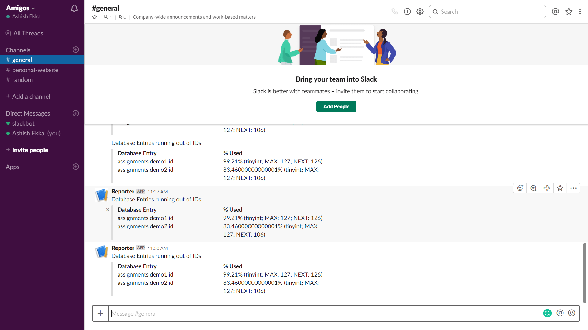

# slack-reporter

Assignment submission for Postman Platform Engineer Intern. slack-reporter is a node script to identify all those tables in the database that may run out of auto incremented IDs. It identifies all those tables and sends a slack message for the same.

  - It uses MySQL's [sys](https://dev.mysql.com/doc/refman/8.0/en/sys-schema.html) database.
  - It uses Slack's [Webhooks](https://api.slack.com/incoming-webhooks) to send messages to Slack.
  - The [app](https://slack-reporter.herokuapp.com) is going to be deployed on Heroku.



### Tech

slack-reporter uses a number of open source projects to work properly:

* [node.js] - evented I/O for the backend
* [Express] - fast node.js network app framework [@tjholowaychuk]
* [MySQL] - Relational Database
* [mysql] - A pure node.js JavaScript Client implementing the MySql protocol.

### Installation

slack-reporter requires [Node.js](https://nodejs.org/) v6+ to run.

Install the dependencies and start the server. By default it runs at port 5000.

```sh
$ cd slack-reporter
$ npm install
$ node app.js
```

### Todos

 - ~~Add a cloud database to run on Heroku.~~
 - ~~Add support for Slack commands.~~
 - Optimizations

License
----

MIT

   [node.js]: <https://nodejs.org>
   [@tjholowaychuk]: <https://twitter.com/tjholowaychuk>
   [express]: <https://expressjs.com>
   [MySQL]: <https://www.mysql.com/>
   [mysql]: <https://github.com/mysqljs/mysql>
